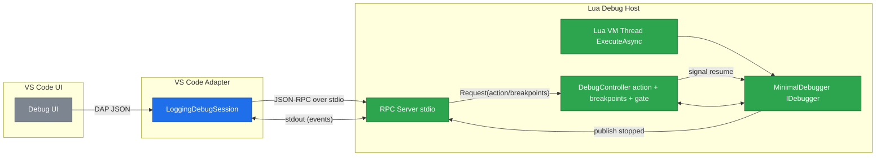
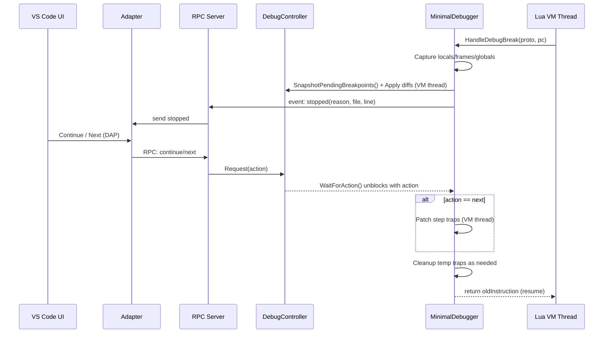

Lua-CSharp VS Code Debugger

# Execution Model

This document describes the single-threaded execution and debug control model for the Lua-CSharp debugger, and how the debug adapter, RPC server, and VM thread coordinate. It focuses on making step/continue deterministic and thread-safe.

## Core Principles

- Single owner of execution: Only the Lua VM thread (ExecuteAsync/HandleDebugBreak) mutates bytecode, sets/clears step traps, and resumes.
- Command queue + gate: The RPC thread never patches code. It enqueues a requested action (continue/next/…) and signals the VM thread to act.
- Blocking stop loop: On a debug trap, the VM thread captures state, emits a stopped event, then blocks until an action is requested.
- Breakpoint diffs on stop: setBreakpoints only updates desired state; actual patching happens on RegisterPrototype (VM thread) and at the next stop (VM thread) by applying diffs.
- Ordered I/O: RPC writes to stdout are synchronous and serialized to avoid interleaved DAP messages.

## Components

- VS Code adapter: Translates DAP requests to RPC commands; displays stopped state, stack, variables.
- RPC server: Stdio loop parsing JSON-RPC, queues actions, and emits ordered events/responses.
- DebugController (shared state):
  - Holds requested action, pending breakpoints map, and a resume gate (e.g., ManualResetEventSlim).
  - API: `Request(action)`, `UpdateBreakpoints(source, lines)`, `WaitForAction()`, `SnapshotPendingBreakpoints()`.
- MinimalDebugger (VM-threaded): Implements `IDebugger.HandleDebugBreak`. Captures locals, applies breakpoint diffs and step traps, publishes `stopped`, then blocks on the controller for the next action, cleans up step traps, and resumes.

## Architecture (Mermaid)

## Stop/Resume Loop (Mermaid Sequence)

## Responsibilities

- Adapter (TypeScript)
  - Forwards DAP requests `continue`, `next`, `setBreakpoints`, `disconnect` to RPC.
  - Renders `stopped`, `terminated`, `output`. Fetches locals/globals on demand.

- RPC Server (C#)
  - Single-threaded stdio loop; emits ordered JSON messages with a write lock.
  - Queues actions into `DebugController` and replies to RPC requests.

- DebugController (C#)
  - Thread-safe: holds requested action and desired breakpoints.
  - Provides a blocking `WaitForAction()` for the VM thread during a stop.

- MinimalDebugger (C#)
  - Runs only on the Lua VM thread.
  - Applies breakpoint diffs and step traps.
  - Emits `stopped` and blocks on `WaitForAction()`; on resume, cleans up and returns.

## Step Over (Next)

- Adapter sends `next` over RPC.
- RPC records `RequestedAction = Next` and signals the gate.
- MinimalDebugger (on VM thread), after `WaitForAction()`:
  - Computes candidate instructions in the same prototype whose `LineInfo` differs from the current line.
  - Patches temp debug traps at those candidates to stop at the first actually executed next line.
  - Resumes by returning the original instruction.

## Breakpoints Application

- setBreakpoints updates the desired set in `DebugController` only.
- At the next stop, `MinimalDebugger` reconciles desired vs. actual patches for current and known prototypes.
- `RegisterPrototype` (VM thread) also applies any pending breakpoints for newly seen chunk names.

## Determinism & Safety

- No off-thread patching: RPC never touches bytecode; only the VM thread patches/unpatches.
- Ordered I/O: All events/responses are synchronously written with a lock.
- One stop per trap: `HandleDebugBreak` publishes exactly one `stopped` then blocks until action.
- Cleanup on resume: Temp step traps are removed when resuming to avoid re-triggers.

